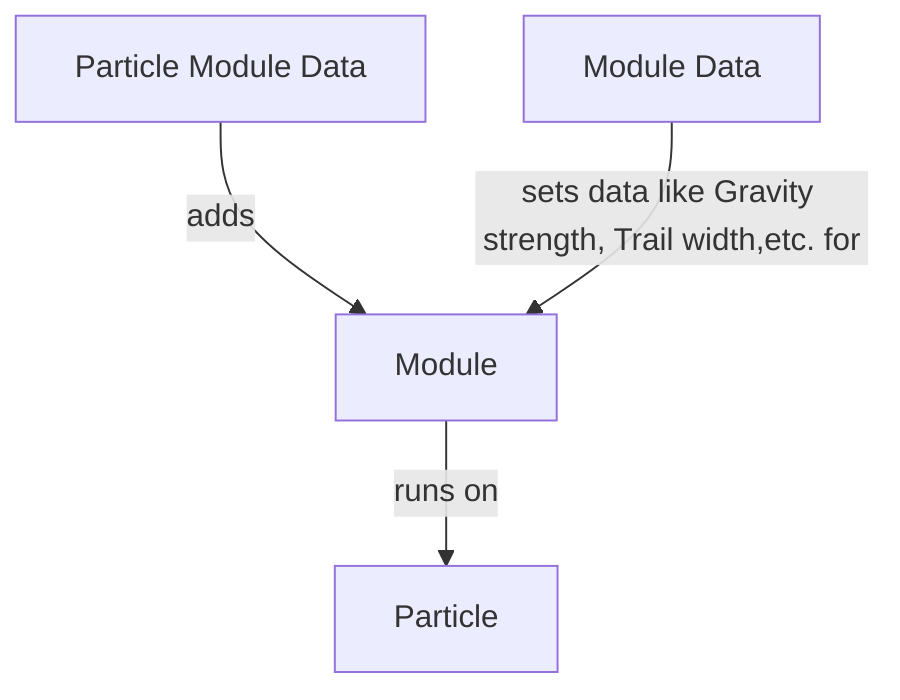

# Quasar

Todo short Text about Quasar

Advantages:
- FULLY resource-pack driven

# Key concepts

<p>❗ These paths go off of `assets/modid/quasar`.</p>

### Particle Emitters

| Folder | emitters|
| ------ | ------- |
| Link   | [Github](https://github.com/FoundryMC/Veil/blob/1.20/common/src/main/java/foundry/veil/api/quasar/data/ParticleEmitterData.java#L27) |

Particle emitters are the starting point for everything related to Quasar’s particles. They define a few variables about themselves like lifetime and the rate at which they emit particles, but more importantly they hold the links to the Particle data and Shape that each describe specific properties of the spawned particles.

### Modules

| Folder | modules|
| ------ | -------|
| Link   | [Github](https://github.com/FoundryMC/Veil/tree/1.20/common/src/main/java/foundry/veil/api/quasar/data/module) |

Modules are the most powerful building block of Quasar. A module is code attached to a particle, where it is executed at a specific time, depending on which kind of module it is. They are what makes particles dynamic by defining movement, color changes or light emission.

The simplest module definition would look like this:

```json
{
  "module": "die_on_collision"
}
```

Modules are interacted with by making a json for the Module instance, telling it which `module` to use and adding the parameters the module takes in as further fields.

We are gonna go into more detail how they work internally in [`Creating Costum Modules`](https://github.com/foundrymc/veil/wiki/quasar#creating-costum-Modules).

### Particle Data

| Folder | modules/particle_data |
| ------ | --------------------- |
| Link   | [Github](https://github.com/FoundryMC/Veil/blob/1.20/common/src/main/java/foundry/veil/api/quasar/data/QuasarParticleData.java#L52) |

Defines the modules to attach to a particle and optionally the texture(s) for it. Also defines collision and the render style, which can be either `CUBE` or `BILLBOARD`. `BILLBOARD` is meant for particles with Textures that always face the player, whereas `CUBE` displays colored, textureless cubes.

### Shape

| Folder | modules/emitter/particle/shape |
| ------ | ------------------------------ |
| Link   | [Github](https://github.com/FoundryMC/Veil/tree/1.20/common/src/main/java/foundry/veil/api/quasar/emitters/shape) |

A shape describes where relative to the location of the Particle Emitter to spawn the individual particles. When spawning the particle a random point on the surface of the shape is picked

Possible Shapes (Lower- or Uppercase works):

`point`,
`hemisphere`(half sphere),
`cylinder`,
`sphere`,
`cube`,
`torus`(Donut),
`disc`,
`plane`

## Particle Settings

| Folder | modules/emitter/particle|
| ------ | ----------------------- |
| Link   | [Github](https://github.com/FoundryMC/Veil/blob/1.20/common/src/main/java/foundry/veil/api/quasar/data/ParticleSettings.java#L26) |

Sets lifetime, size, speed, initial rotation and the ranges for randomizing them.

# Working with Quasar

### Particle Editor

Not Currently Finished! Please return at a later point for documentation and use the `Resource Browser` or a Text Editor of your choice for now.

### Resource Browser

Veil has a Resource browser that allows you to edit any text file from any resource pack in-game and save it. It can be opened by pressing the (by default) F6 key. Files can be edited by clicking on them with the Right mouse button, which will open a context window with the option `Open in Veil Text Editor` option. This will open a code editor layered over Minecraft. When you have edited the file and want to apply the changes, save it using the editor and either press `F3+t` or use the `Reload Resources` button at the top of the Resource Browser window to reload all Resource Packs.

# Getting started

### Setting up the resource pack

Let‘s start by creating a resource pack with a folder structure for our particle in the `resourcepacks` folder of a Minecraft Instance running Veil:

```markdown
resourcepacks
\-particles
  |-pack.mcmeta
    \-assets
      \-modid
        \-quasar
          |-emitters
          |-modules
            |-render
            |-update
            |-init
            |-force
            |---collision
            \-particle_data
              \-emitter
                \-particle
                  \-shape
```

Note that you have to replace `modid` with the ID of the mod you want to add Particles for.

For your pack.mcmeta you can just put something like this where Pack format 15 is for Minecraft 1.20.1. [For the other ones look here](https://minecraft.wiki/w/Pack_format#List_of_resource_pack_formats)

```json
{
  "pack": {
    "pack_format": 15,
    "description": "Resource pack for testing Quasar"
  }
}
```

### Making a particle

In this section I would go through all the files of a full particle definition and explain each file on an Example

### Spawning particles

**Java**

Since Quasar uses Resource packs for it‘s particles, it is suggested to make the code for spawning particles fault-tolerant. A method like this could be located in your Mods Client class to access it quickly. Since this code is wrapped in a `try`-`catch`-block it will just stop executing if it encounters a error at any point:

```java
//Note that you have to pass in either a entity or a location
//The code is just written this way so that it is clear that these values CAN be null,
//however a particle that is spawned somewhere in the world isn't of much use so you need either a Location or a entity
public static void spawnParticle(@Nullable Vec3 position, @Nullable Entity entity, ResourceLocation id){
        try {
            ParticleSystemManager manager = VeilRenderSystem.renderer().getParticleManager();
            ParticleEmitter emitter = manager.createEmitter(id);
            if (entity!=null) {
                emitter.setAttachedEntity(entity);
            } else if (position!=null) {
                emitter.setPosition(position);
            }
            manager.addParticleSystem(emitter);

        } catch (Exception ignored) {

        }
    }
```

**Command**

You can also use the `/quasar` command to spawn the particle. It’s syntax is `/quasar <particleemitter> <position>`. Please note that this command only exists client-side and can therefore not be executed by anything other than the player directly.

# Modules

All available Modules and their IDs for use in the Particle Module data can be found [here.](https://github.com/FoundryMC/Veil/blob/4361244986c2c6d3430484c11b72f83dd3cd5e9b/common/src/main/java/foundry/veil/api/quasar/data/module/ModuleType.java#L19-L54)

Example modules for explaining structure: Dieoncollision&Trail?

In case we‘ve lost you somewhere between Particle Module Data, Module Data and Modules here‘s the terminology:

**Module Data**: Json-defined Arguments for a specific Module. The corresponding Java record handles applying modulesto the particle using the data from the Json.

**Module**: Interface-implementing class that takes values from the Module Data to use them in logic executed on the particle (`render`,`init`,`update`)

**Particle Module Data**: Defines the modules to attach to the particle



`ParticleModuleData.addModules` is called on the Data of every Module applied to the Particle when the particle is spawned and can be used to add different modules based on the module data. For example there’s only a `LightModuleData` which, depending if a color or alpha gradient is defined, either adds a `StaticLightModule` or a `DynamicLightModule` to the particle to save calculations.

The module itself consists of a Class that implements a `ParticleModule` Interface for the Particle‘s lifecycle: `Render`, `Update`, `Init`, `Force` and `Collision`

Should I go over creating a new module as an example step-by-step? Don‘t think so since the people that want to make that complex particles are probably more experienced in Java
